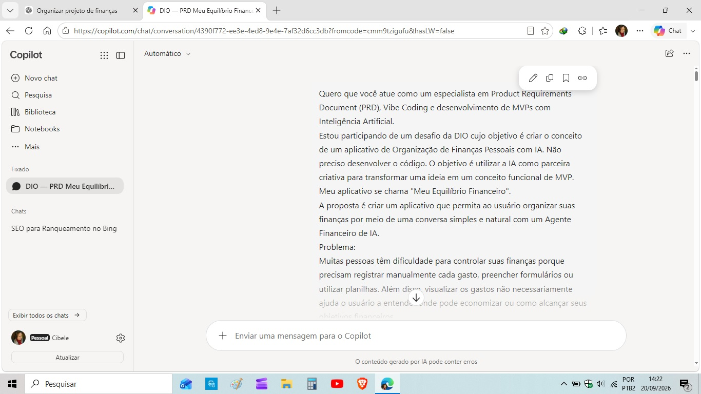
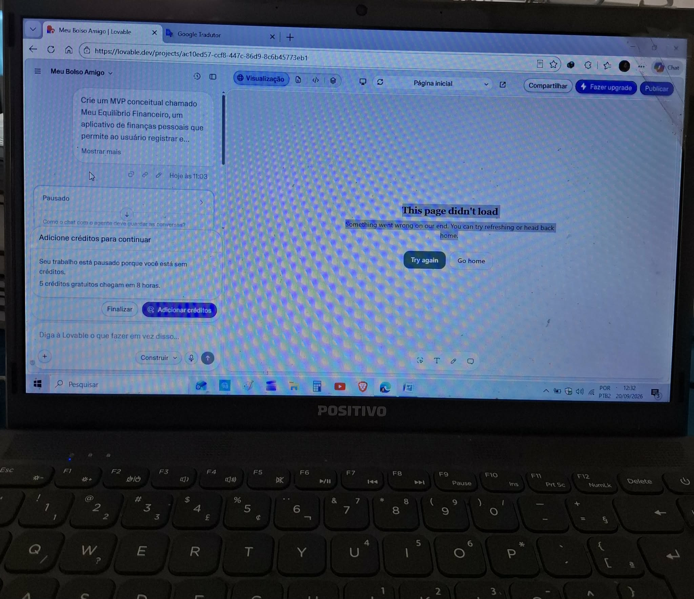
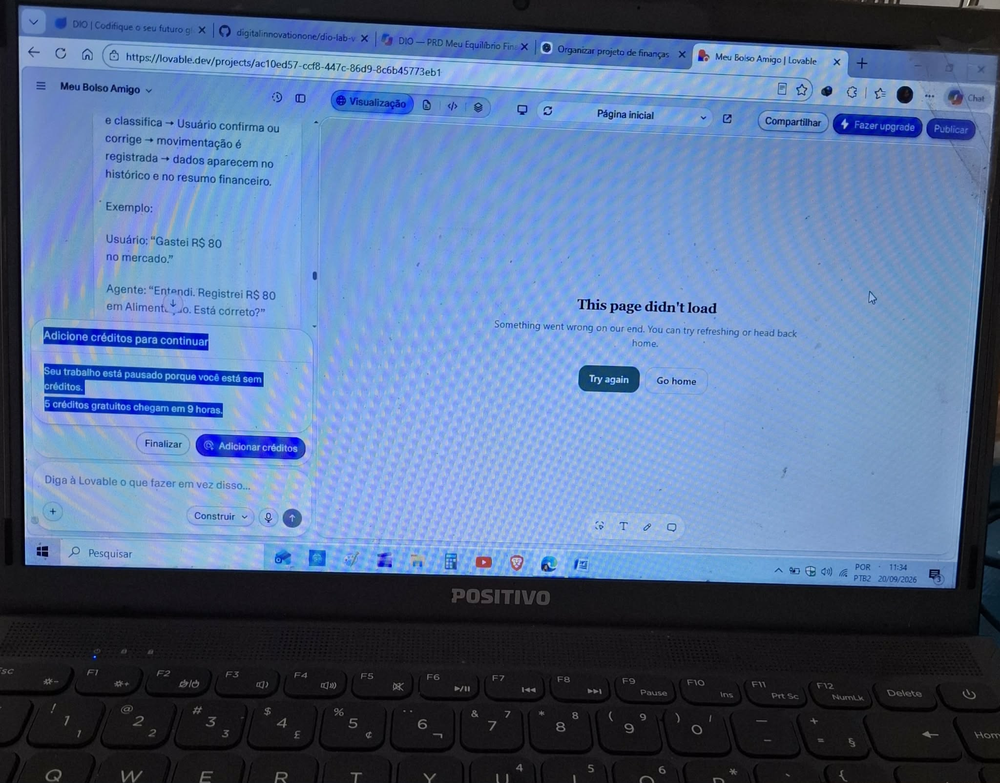

# 💸 App de Finanças Pessoais — Meu Equilíbrio Financeiro com Vibe Coding

## 💡 Sobre o projeto

**Meu Equilíbrio Financeiro** é um protótipo de aplicativo de organização financeira desenvolvido a partir da proposta de **Vibe Coding**, utilizando a Inteligência Artificial como parceira na criação, exploração e refinamento da ideia.

A proposta surgiu a partir do desafio de tornar o controle financeiro mais simples e acessível, permitindo que o usuário registre suas movimentações utilizando linguagem natural, como:

> "Gastei R$ 80 no mercado."

A partir dessa ideia, o projeto foi explorado inicialmente com o **Copilot** e o **Lovable**, passando por diferentes possibilidades de interface e conceito até chegar ao protótipo funcional final.

---

## 🎯 Desafio

O desafio propõe utilizar conceitos de **Vibe Coding** e **MVP (Produto Mínimo Viável)** para desenvolver o conceito de um aplicativo capaz de facilitar a organização das finanças pessoais por meio de uma interação simples e conversacional.

---

## 🧠 PRD refinado pelo Copilot

O prompt inicial foi apresentado ao Copilot para revisão e aprimoramento. A partir dessa interação, a proposta foi estruturada em um PRD, utilizado como briefing para orientar o desenvolvimento do projeto.

### Contexto

Quero criar um aplicativo de organização de finanças pessoais chamado **Meu Equilíbrio Financeiro**.

A proposta é tornar o controle financeiro mais simples e acessível, permitindo que o usuário registre receitas e despesas por meio de uma conversa natural com um **Agente Financeiro virtual**.

O aplicativo deve ter uma interface acolhedora, simples e intuitiva, especialmente para pessoas que estão começando a organizar sua vida financeira e podem se sentir intimidadas por aplicativos complexos ou planilhas.

### Problema

Muitas pessoas têm dificuldade para acompanhar suas finanças porque o controle dos gastos pode parecer complicado e exigir muitos registros manuais.

Quero criar uma experiência mais natural, na qual o usuário possa escrever algo como:

**"Gastei R$ 80 no mercado."**

e o sistema reconheça a movimentação, identifique o valor, classifique a categoria e atualize automaticamente o resumo financeiro.

### Público-alvo

Pessoas que desejam começar ou melhorar a organização das suas finanças pessoais de maneira simples, prática e acessível, principalmente usuários iniciantes.

### Objetivo do MVP

Criar um protótipo funcional que simule a experiência de conversar com um Agente Financeiro e permita ao usuário:

1. Registrar receitas e despesas por linguagem natural.
2. Classificar automaticamente as movimentações.
3. Consultar um resumo financeiro.
4. Criar e acompanhar metas financeiras.
5. Receber sugestões educativas de economia.
6. Visualizar o histórico e as principais categorias de gastos.

### Funcionalidades principais

#### 1. Agente Financeiro

Criar uma interface de conversa na qual o usuário possa registrar movimentações e fazer perguntas sobre suas finanças.

O agente deve utilizar linguagem simples, acolhedora e educativa.

Exemplos:
- "Gastei R$ 80 no mercado."
- "Recebi R$ 2.500 de salário."
- "Como estão minhas finanças?"
- "Quero criar uma meta."

#### 2. Registro e classificação

Ao identificar uma movimentação, o sistema deve reconhecer:
- tipo: receita ou despesa;
- valor;
- descrição;
- categoria;
- data.

As despesas podem ser classificadas em categorias como Alimentação, Transporte, Saúde, Moradia, Educação, Lazer, Compras e Outros.

#### 3. Resumo Financeiro

Apresentar de forma visual e simples:
- total de receitas;
- total de despesas;
- saldo;
- histórico das movimentações;
- principais categorias de despesas.

#### 4. Metas Financeiras

Permitir que o usuário crie uma meta informando:
- nome;
- valor desejado;
- valor já guardado;
- prazo opcional.

O aplicativo deve apresentar o progresso da meta de forma visual.

#### 5. Sugestões de Economia

Apresentar sugestões educativas baseadas nas categorias de despesas registradas, incentivando o usuário a observar seus hábitos financeiros e fazer pequenos ajustes.

### Interface

Criar uma interface moderna, limpa, acolhedora e responsiva, com navegação simples.

As principais áreas devem ser:
- Início;
- Agente Financeiro;
- Resumo;
- Metas;
- Economia.

### Tecnologias e abordagem

O projeto deve ser desenvolvido utilizando o conceito de **Vibe Coding**, utilizando ferramentas de inteligência artificial como parceiras no processo de criação, refinamento e desenvolvimento da solução.

O protótipo pode utilizar HTML, CSS e JavaScript para simular a experiência do aplicativo.

Os dados demonstrativos e as movimentações registradas pelo usuário podem ser armazenados localmente no navegador para permitir a interação com o protótipo.

### Limitações do protótipo

Este projeto é um MVP educacional.

O Agente Financeiro é uma simulação baseada em regras JavaScript e não utiliza uma API de inteligência artificial em tempo real.

O protótipo não realiza aconselhamento financeiro profissional, não recomenda investimentos e não possui integração com bancos ou instituições financeiras.

### Resultado esperado

Ao final, quero ter um protótipo funcional que demonstre como uma experiência baseada em conversa pode tornar a organização financeira mais simples, permitindo que o usuário registre movimentações, acompanhe seu resumo, estabeleça metas e receba sugestões educativas em uma interface acessível.

---

## 🤖 Desenvolvimento com Inteligência Artificial

### Copilot

O processo começou com a elaboração de um primeiro prompt para apresentar a ideia do aplicativo e solicitar seu refinamento.

O registro acima mostra o início da interação com o Copilot, a partir do prompt inicial utilizado para apresentar a ideia do projeto.

A interação com o Copilot ajudou a estruturar e aprimorar a proposta, resultando no PRD apresentado acima.

---

### 🎨 Exploração no Lovable

Após o refinamento da ideia, o projeto foi explorado no **Lovable**, principalmente para experimentar possibilidades de interface e apresentação visual.

Durante essa etapa, apresentei a proposta do aplicativo com o nome **“Meu Equilíbrio Financeiro”**. Ao gerar a proposta visual, porém, o Lovable alterou o nome apresentado na interface para **“Meu Bolso Amigo”**.

Essa etapa permitiu explorar diferentes possibilidades visuais e observar como a ferramenta interpretava e transformava as instruções fornecidas.

🎥 **Registro em vídeo:**

Fiz um vídeo para registrar as três opções visuais apresentadas pelo Lovable durante essa exploração, porém, devido ao tamanho do arquivo, o GitHub não realizou sua reprodução diretamente na página do README e acabei excluindo o vídeo no repositório.

### ⚠️ Limitação encontrada

Durante a utilização do Lovable, os créditos disponíveis foram esgotados, impedindo a continuidade da exploração da ferramenta.

Diante dessa limitação, foi necessário adaptar a estratégia de desenvolvimento e continuar o projeto utilizando uma abordagem com **HTML, CSS e JavaScript**.

---

## 🛠️ Desafios encontrados e adaptações

Durante o desenvolvimento, alguns fatores tornaram o processo mais demorado.

Um dos desafios foi utilizar um notebook mais antigo, com pouca memória disponível. Isso fez com que algumas etapas de desenvolvimento e testes fossem mais lentas.

Também houve a limitação relacionada aos créditos disponíveis no Lovable, que impediu a continuidade da exploração da ferramenta.

Diante dessas limitações, foi necessário adaptar a estratégia e continuar o desenvolvimento utilizando HTML, CSS e JavaScript, mantendo a proposta do MVP.

Essas dificuldades fizeram parte do aprendizado e mostraram que o desenvolvimento com IA envolve não apenas criar prompts, mas também testar, identificar problemas e buscar alternativas.

---

## 🧪 Testes e correções

Durante o teste da versão publicada, foi identificado um problema em que os botões do aplicativo não respondiam.

A investigação mostrou que o arquivo JavaScript existente no projeto tinha o nome:

`script.js`

enquanto o `index.html` estava procurando:

`app.js`

Após corrigir o nome do arquivo para `app.js`, o aplicativo passou a funcionar corretamente.

Esse processo foi importante para compreender que, mesmo utilizando ferramentas de IA, é necessário **testar o resultado, identificar erros e validar o funcionamento da aplicação**.

---

## ✨ Funcionalidades do protótipo final

O protótipo permite:

- Registrar receitas e despesas.
- Utilizar linguagem natural para registrar gastos.
- Classificar movimentações.
- Consultar o resumo financeiro.
- Visualizar saldo e movimentações.
- Criar metas financeiras.
- Consultar sugestões de economia.
- Armazenar os dados localmente no navegador.

---

## 🌐 Projeto publicado

O protótipo funcional foi publicado utilizando GitHub Pages.

**Meu Equilíbrio Financeiro:**

https://cibelealbrecht-dev.github.io/meu-equilibrio-financeiro/

---

## 📚 Reflexão sobre o processo

### O que funcionou?

A utilização da Inteligência Artificial ajudou a transformar uma ideia inicial em uma proposta mais estruturada.

O processo de Vibe Coding permitiu experimentar diferentes possibilidades e utilizar a IA como parceira na criação e no refinamento da ideia.

A interação com o Copilot ajudou no refinamento da proposta e do prompt, enquanto o Lovable possibilitou explorar propostas visuais para o aplicativo.

Ao final, foi possível chegar a um protótipo funcional com navegação, agente financeiro, registro e classificação de movimentações, resumo financeiro, metas e sugestões de economia.

### O que não funcionou?

O uso do Lovable foi limitado pela quantidade de créditos disponíveis, o que impediu a continuidade daquela etapa.

Também houve limitações de desempenho do equipamento utilizado, um notebook mais antigo e com pouca memória, o que tornou algumas etapas mais demoradas.

Durante os testes do projeto publicado também foi necessário identificar e corrigir uma diferença entre o nome do arquivo JavaScript e o arquivo indicado pelo `index.html`.

### O que aprendi sobre conversar com IAs?

Aprendi que a qualidade do resultado depende muito da clareza das instruções fornecidas.

Um prompt mais organizado, com contexto, problema, público-alvo e funcionalidades, ajuda a Inteligência Artificial a compreender melhor o que está sendo proposto.

Também aprendi que **Vibe Coding não significa simplesmente deixar a IA fazer tudo**. É necessário saber explicar a ideia, analisar as respostas, testar o resultado, identificar problemas e tomar decisões durante o processo.

A experiência mostrou que a IA pode ser uma importante parceira de criação, mas a pessoa continua responsável por orientar o projeto e validar o resultado.

---

## 💭 Conclusão

O desenvolvimento do **Meu Equilíbrio Financeiro** foi uma experiência prática de utilização da Inteligência Artificial como parceira no processo de criação de um produto digital.

Mesmo encontrando limitações de ferramentas, equipamento e tempo, foi possível adaptar o caminho, testar diferentes possibilidades e concluir um protótipo funcional.

Mais do que desenvolver um aplicativo, o projeto permitiu compreender na prática como **ideias, prompts, IA, testes e adaptações podem trabalhar juntos dentro de uma abordagem de Vibe Coding**.
